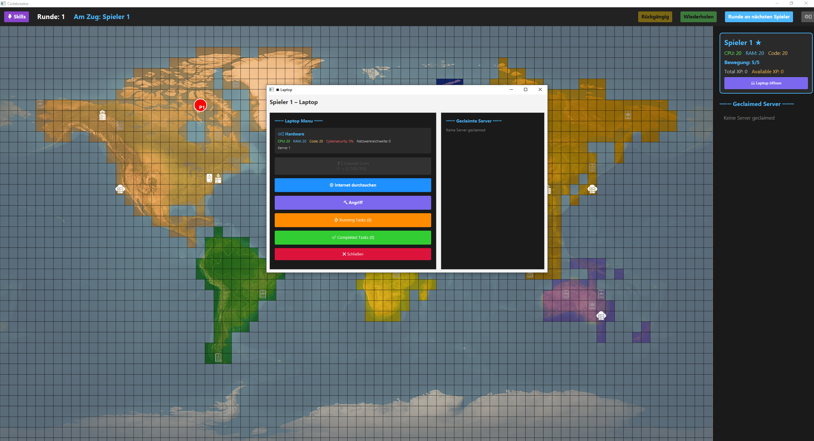
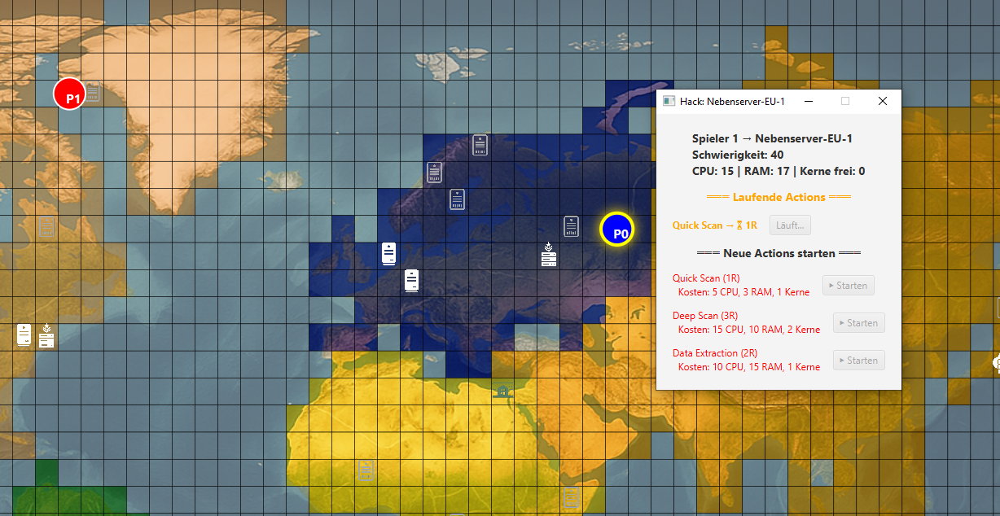
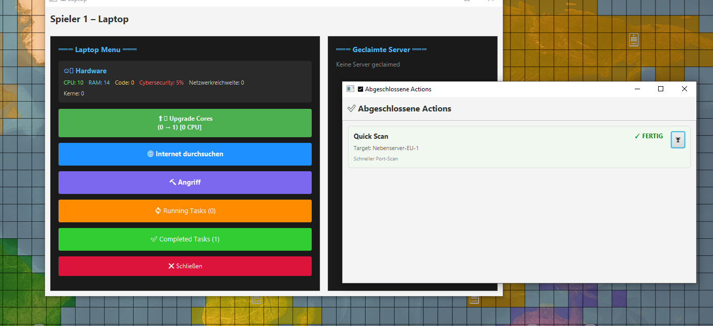
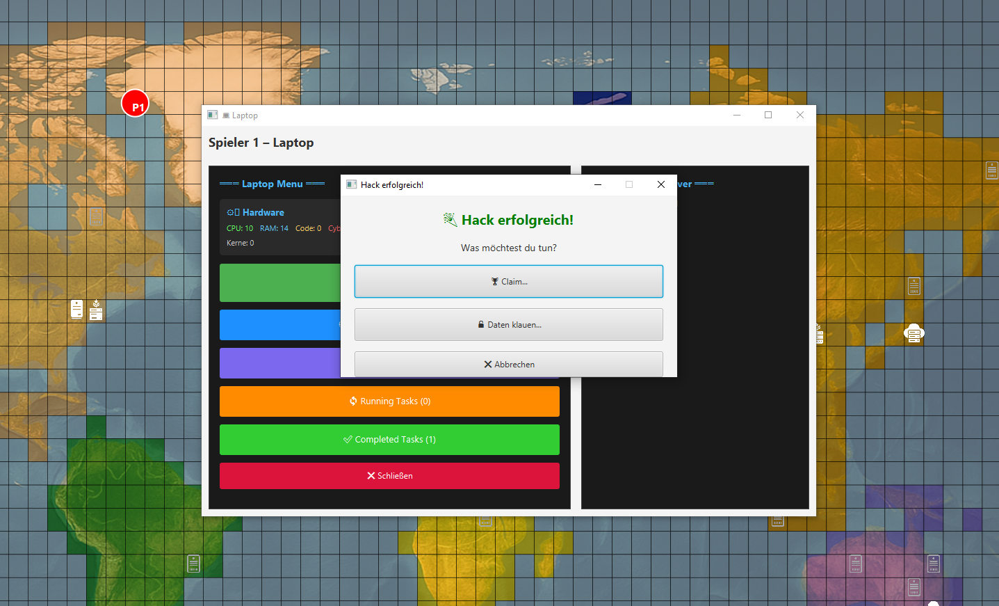
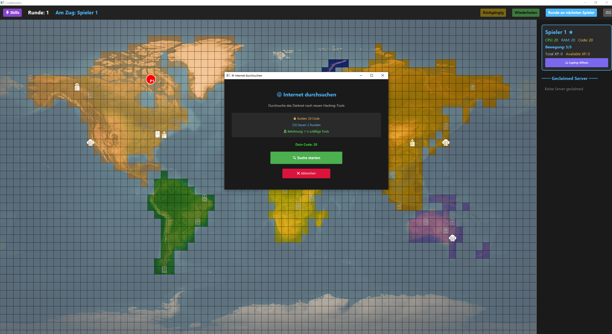
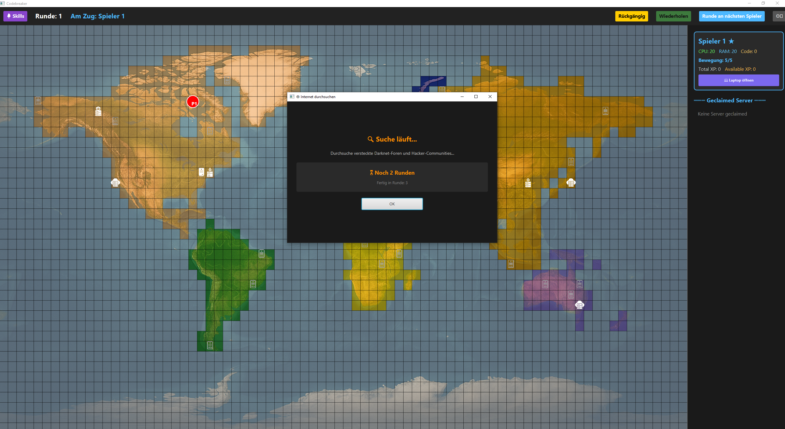
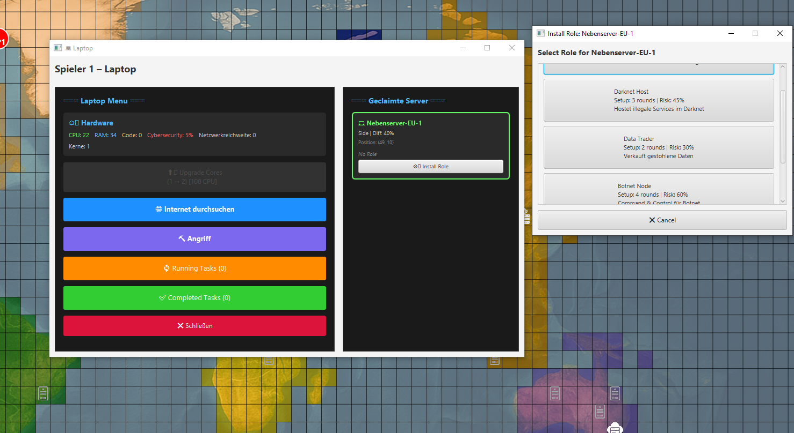
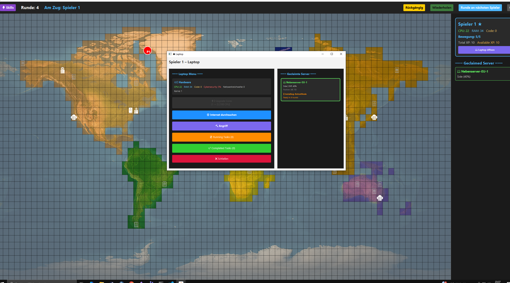
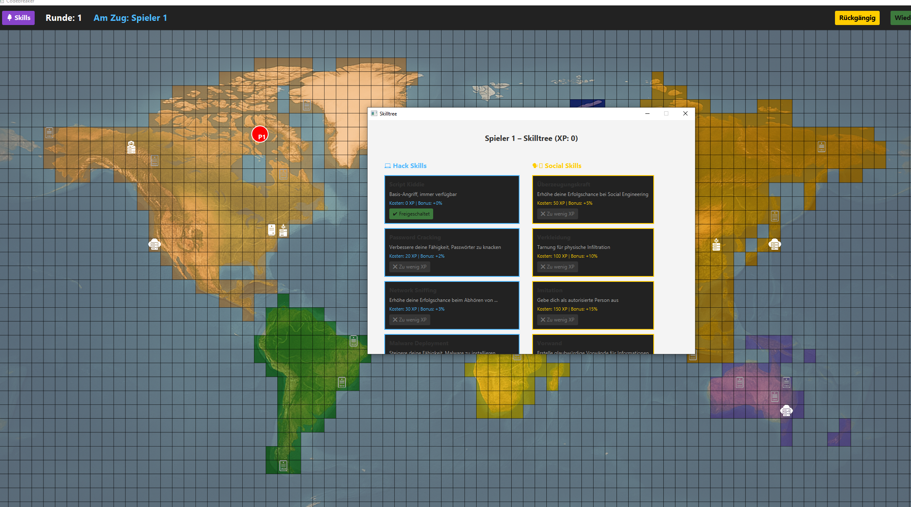

<div align="center">

# 🎮 Codebreaker: Cyberkrieg

[](https://coveralls.io/github/htwg-codebreaker-org/codebreaker?branch=main)


*Ein rundenbasiertes Strategie-Spiel im Cyberkrieg-Setting*

</div>

---

## 📖 Über das Projekt

**Codebreaker: Cyberkrieg** ist ein rundenbasiertes Strategiespiel, bei dem Spieler in die Rolle von Hackern schlüpfen und versuchen, Serverinfrastrukturen weltweit zu kompromittieren.

### 🌐 Grundlegende Idee

Die ursprüngliche Vision und Konzeptentwicklung finden Sie auf unserer GitHub Page:  
**[→ Grundlegende Idee und Design-Dokumente](https://iamnico42.github.io/portfolio/studium/Codebreaker%20-%20Cyberkrieg%28Scala%29/Grundlegende%20Idee/)**

---

## ✨ Implementierte Features

### 🗺️ Spielwelt & Bewegung
- **Globale Weltkarte** mit 7 Kontinenten (Nordamerika, Südamerika, Europa, Afrika, Asien, Ozeanien, Antarktis)
- **Tile-basiertes Bewegungssystem** mit Bewegungspunkten
- **Mehrspieler-Unterstützung** mit rundenbasiertem Gameplay
- **Dynamische Kartenvisualisierung** in TUI und GUI

### 💻 Server & Hacking
- **7 verschiedene Servertypen** mit unterschiedlichen Schwierigkeiten und Belohnungen:
  - **Side** - Einfache Server für Einsteiger (10 XP)
  - **Firm** - Unternehmensserver (20 XP)
  - **Cloud** - Cloud-Infrastruktur (30 XP)
  - **Bank** - Finanzserver (40 XP, Code-Belohnung)
  - **Military** - Militärische Systeme (50 XP, doppelte Ressourcen)
  - **GKS** - Hochsicherheitsserver (100 XP)
  - **Private** - Private Systeme (spezielle Bedingungen)
- **Hack-Erfolgswahrscheinlichkeit** basierend auf:
  - Server-Schwierigkeit (0-100%)
  - Spieler-Cybersecurity-Level
  - Skill-Boni
- **Ressourcen-Management**: CPU, RAM, Code
- **Belohnungssystem** mit XP, Ressourcen und Code

### 🎯 Skill-System
- **Skill-Tree-System** mit freischaltbaren Hack-Skills
- **XP-basierte Progression** (Available XP & Total XP Earned)
- **Skill-Voraussetzungen** für verschiedene Hacking-Operationen
- **Permanente Skill-Upgrades** durch XP-Investition

### 🎮 Game Mechanics
- **Command Pattern** mit Undo/Redo-Funktionalität
- **Rundenbasiertes System** mit Phasen (Awaiting Input, Executing Turn)
- **Observer Pattern** für reactive UI updates
- **Game State Management** (Running, Paused, Finished)
- **Save/Load-System** (JSON & XML Format)

### 🖥️ Benutzeroberflächen
- **Text User Interface (TUI)**
  - ANSI-Farbcodes für bessere Lesbarkeit
  - Kontinente mit Abkürzungen (NA, SA, EU, AF, AS, OC, AN)
  - Kommandozeilen-Interface für schnelles Gameplay
  
- **Graphical User Interface (GUI)**
  - JavaFX/ScalaFX basiert
  - Skalierbare, responsive UI-Komponenten
  - Interaktive Weltkarte mit Zoom
  - Player-Sidebar mit Statistiken
  - Top-Bar mit Undo/Redo/Pause,SkillTree
  - Notification-System für Hack-Erfolge
  - Pausenmenü mit Save-Funktionalität

### 🏗️ Architektur & Design Patterns
- **Model-View-Controller (MVC)** Architektur
- **Command Pattern** für alle Spielaktionen
- **Observer Pattern** für UI-Updates
- **Strategy Pattern** für Server-Generation und Skill-Trees
- **Builder Pattern** für Game-Initialisierung
- **Dependency Injection** mit Google Guice
- **Decorator Pattern** für Logging (LoggingController)

---

### Einblicke in das Spiel

# 📸 Screenshots

| Feature | Screenshot |
|---------|-----------|
| **Hauptansicht** |  |
| **Laptop Menü** |  |
| **Server in Reichweite** |  |
| **Server außer Reichweite** |  |
| **Laufender Angriff** |  |
| **Angriff abgeschlossen** |  |
| **Angriff Auswertung** |  |
| **Internet durchsuchen** |  |
| **Internetsuche läuft** |  |
| **Server Roles** |  |
| **Server Role Install** |  |
| **Skill-System** |  |

---

## 🚀 Installation & Ausführung

### 📦 Docker Build

Erstelle das Docker-Image vom Projekt-Root-Verzeichnis:

```bash
docker build -t codebreaker:v1 .
```

Das Image enthält:
- ☕ Java 21
- 🔴 Scala 3.6.4
- 🛠️ SBT Build Tool
- 📚 Alle erforderlichen Dependencies

---

### 🎮 TUI-Modus (Konsole)

Funktioniert **auf allen Systemen ohne zusätzliches Setup**:

```bash
docker run -ti codebreaker:v1
```

Die Anwendung startet automatisch im **textbasierten Modus**, wenn keine grafische Anzeige verfügbar ist.

#### TUI-Kommandos:
- `m <x> <y>` - Spieler bewegen
- `h <server-name> <skill-id>` - Server hacken
- `s <skill-id>` - Skill freischalten
- `next` - Nächster Spieler
- `undo` / `redo` - Aktionen rückgängig machen / wiederholen
- `save` / `load` - Spielstand speichern / laden
- `help` - Hilfe anzeigen
- `q` - Spiel beenden

---

### 🖼️ GUI-Modus (JavaFX)

Docker-Container haben standardmäßig keine grafische Ausgabe.  
Für die JavaFX-GUI wird ein **externer X11-Server** auf dem Host-System benötigt.

#### 🪟 Windows Setup (empfohlen aus der Vorlesung)

1. **VcXsrv (XLaunch) installieren**  
   📥 Download: [https://sourceforge.net/projects/vcxsrv/](https://sourceforge.net/projects/vcxsrv/)

2. **XLaunch starten** mit folgenden Einstellungen:
   - ✅ Multiple windows
   - ✅ Display number: `0`
   - ✅ Start no client
   - ✅ **Disable access control** aktivieren
   - ❌ Alle anderen Optionen deaktivieren

3. **Container mit GUI-Unterstützung starten:**

```bash
docker run -e DISPLAY=host.docker.internal:0 -ti codebreaker:v1
```

4. **X11-Server beenden** (läuft im Hintergrund nach dem Start):

```bash
taskkill /IM vcxsrv.exe /F
```

#### 🐧 Linux Setup

```bash
xhost +local:docker
docker run -e DISPLAY=$DISPLAY -v /tmp/.X11-unix:/tmp/.X11-unix -ti codebreaker:v1
```

#### 🍎 macOS Setup

1. **XQuartz installieren**: [https://www.xquartz.org/](https://www.xquartz.org/)
2. XQuartz starten und in Einstellungen "Allow connections from network clients" aktivieren
3. Terminal öffnen:

```bash
xhost + 127.0.0.1
docker run -e DISPLAY=host.docker.internal:0 -ti codebreaker:v1
```

---

## 🛠️ Entwicklung

### Projekt kompilieren

```bash
sbt compile
```

### Tests ausführen

```bash
sbt test
```

### Mit Coverage-Report

```bash
sbt clean coverage test coverageReport
```

### Docker Image lokal bauen und testen

```bash
docker build -t codebreaker:dev .
docker run -ti codebreaker:dev
```

---

## 📊 Technologie-Stack

- **Scala 3.6.4** - Moderne funktionale Programmierung
- **JavaFX/ScalaFX** - GUI-Framework
- **Google Guice** - Dependency Injection
- **Play JSON/XML** - Persistence Layer
- **ScalaTest** - Testing Framework
- **Logback** - Logging
- **SBT** - Build Tool
- **Docker** - Containerization

---

## 👥 Team

Entwickelt im Rahmen des Software Engineering Kurses an der HTWG Konstanz.

---

## 📄 Lizenz

Siehe [LICENSE](LICENSE) für Details.

---

<div align="center">

**[🌐 GitHub Page](https://iamnico42.github.io/portfolio/studium/Codebreaker%20-%20Cyberkrieg%28Scala%29/Grundlegende%20Idee/)** • **[📊 Coverage Report](https://coveralls.io/github/htwg-codebreaker-org/codebreaker)**

Made in Konstanz

</div>